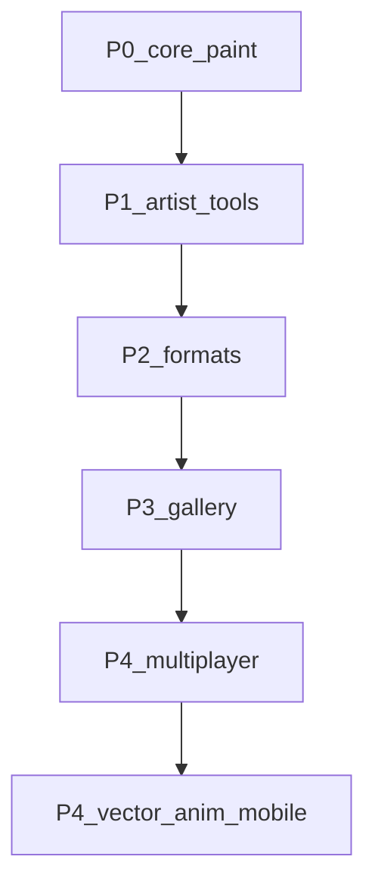

# Beautiful — Feature Roadmap

Легенда: **Done** | **Partial** | **Todo**

Приоритет: **P0** (сейчас) → **P1** → **P2** → **P3** → **P4** (в последнюю очередь).

Обновляй колонку Status по мере работы. Оптимизация (P0-1) — постоянный критерий каждого спринта.

_Статусы сверены с кодом: 2026-08-01._

---

## P0 — ядро рисования и стабильность

| ID | Задача | Status | Notes |
|----|--------|--------|-------|
| P0-1 | Оптимизация (тайлы, LOD, stroke, память) | Partial | Sparse tiles, LOD, stroke opts; dense composite / scale — ещё работа |
| P0-2 | Больше кистей + вкладки + переключение | Partial | ToolPages + пресеты есть; UX вкладок / библиотека кистей — слабо |
| P0-3 | Текстурные кисти (движок применяет texture) | Partial | Paper/Canvas/Noise в stamp; custom bitmap texture — нет |
| P0-4 | Импорт текстур для кистей | Todo | Файл → библиотека текстур |
| P0-5 | Pasteboard: за холстом + не обрезать при сохранении | Partial | Core (`enable_pasteboard` / stage) есть; **UI Canvas + export stage/full** — нет |
| P0-6 | Замок слоя / папки | Todo | Нельзя случайно править |
| P0-7 | Cut выделением (в буфер) | Partial | Copy/paste Done; Cut — нет |
| P0-8 | Несколько выделений | Todo | Сейчас одно mask/rect |
| P0-9 | Canvas → изменить размер с предпросмотром | Partial | Диалог Canvas Size есть; **live preview** — нет |
| P0-10 | Доработать Crop | Partial | Crop + aspect + straighten; polish preview / UX |
| P0-11 | Недостающие меню (Canvas / Ruler / Help) | Partial | Canvas живой; Ruler/Help = `(soon)` |
| P0-12 | Лёгкий UI: популярные инструменты на виду | Partial | Prefs/accent, иконки, docks; приоритет tools — ещё |

---

## P1 — привычные инструменты

| ID | Задача | Status | Notes |
|----|--------|--------|-------|
| P1-1 | Фигуры: эллипс, треугольник, rect и др. | Todo | Не tip shape кисти |
| P1-2 | Outline | Todo | Обводка выделения/слоя |
| P1-3 | Зеркалирование при рисовании (1+ осей) | Todo | Сейчас только flip после |
| P1-4 | Линейки | Todo | Меню-заглушка |
| P1-5 | Циркуль (в линейках) | Todo | После P1-4 |
| P1-6 | Режимы перспективы | Todo | |
| P1-7 | Оверлеи композиции (трети, золотое сечение) | Todo | View overlay |
| P1-8 | Больше фильтров | Partial | Blur/Correction/Pixelate/Distort/Effects + correction layers |
| P1-9 | Градиент | Done | |
| P1-10 | Буфер обмена | Done | |

---

## P2 — форматы и аддоны

| ID | Задача | Status | Notes |
|----|--------|--------|-------|
| P2-1 | Форматы через аддоны | Partial | Prefs toggles; нужен format API у аддонов |
| P2-2 | Preferences + Rhai addons | Done | Edit → Preferences / Ctrl+, |

---

## P3 — галерея / дом / организация

| ID | Задача | Status | Notes |
|----|--------|--------|-------|
| P3-1 | Корректное время у холстов | Partial | `time_spent` + UI в галерее; проверить точность |
| P3-2 | Теги + общая цветная библиотека тегов | Todo | Сейчас collections |
| P3-3 | NSFW метка + blur | Todo | |
| P3-4 | Демо-холсты | Todo | |
| P3-5 | Никнейм на домашней (для multiplayer) | Todo | После сети |
| P3-6 | «Общий холст» при создании | Todo | После сети |

---

## P4 — в последнюю очередь

| ID | Задача | Status | Notes |
|----|--------|--------|-------|
| P4-1 | Multiplayer / общие холсты | Todo | После стабильного P0–P1 |
| P4-2 | Array как модификатор Blender | Todo | |
| P4-3 | Вектор (опционально) | Todo | |
| P4-4 | Режим анимации | Todo | Второй режим программы |
| P4-5 | Порт на телефоны | Todo | **Только после** desktop polish |

---

## Сделано вне этого roadmap (бонус)

| Фича | Status |
|------|--------|
| Phase A ядро (кисть, стабилизатор, слои, UI) | Done |
| Save/load TXMH, PNG/JPEG, PSD, SAI2 import | Done |
| Undo/history | Done (края: mask/некоторые ops) |
| Mesh / Distort / Free Transform | Done (polish crash/split) |
| Correction layers + layer masks | Done |
| Blend modes (PS/Krita-ish) | Done |
| Navigator, docks, gallery home | Done |
| WinTab fallback | Todo (сейчас Windows Ink / egui pressure) |
| Белый квадрат / acrylic workspace | Open bug (`WHITE_SQUARE_HANDOFF.md`) |

---

## Порядок спринтов

1. **P0** — кисти/текстуры, lock, multi-select/cut, canvas resize/crop, pasteboard UI, меню, UI clarity (+ постоянно P0-1)
2. **P1** — фигуры, mirror, линейки/циркуль, перспектива, overlays, фильтры
3. **P2** — format addons / prefs
4. **P3** — теги / NSFW / время / demos
5. **P4** — multiplayer → array → vector/anim → **mobile последним**

---

## Сводка (после сверки)

| Priority | Done | Partial | Todo |
|----------|------|---------|------|
| P0 | 0 | 9 | 3 |
| P1 | 2 | 1 | 7 |
| P2 | 1 | 1 | 0 |
| P3 | 0 | 1 | 5 |
| P4 | 0 | 0 | 5 |

**Итого по roadmap:** Done **3** · Partial **12** · Todo **20**
