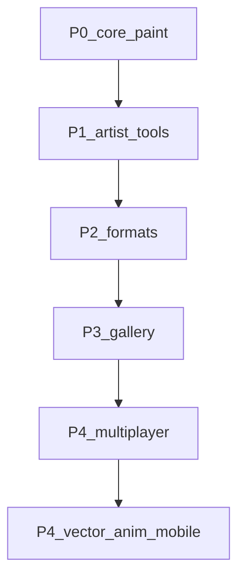

# Beautiful — Feature Roadmap

Легенда: **Done** | **Partial** | **Todo** | **In progress**

Приоритет: **P0** (сейчас) → **P1** → **P2** → **P3** → **P4** (в последнюю очередь).

Обновляй колонку Status по мере работы. Оптимизация (P0-1) — постоянный критерий каждого спринта.

_Статусы сверены с кодом: 2026-08-14._

---

## P0 — ядро рисования и стабильность

| ID | Задача | Status | Notes |
|----|--------|--------|-------|
| P0-1 | Оптимизация (тайлы, LOD, stroke, память) | Partial | Sparse tiles, LOD, brush v2 CPU pass; dense composite / huge docs — ещё работа |
| P0-2 | Больше кистей + вкладки + переключение | Partial | ToolPages + пресеты; полноценная библиотека кистей — слабо |
| P0-3 | Текстурные кисти (движок применяет texture) | Partial | Paper/Canvas/Noise + intensity в stamp; **bitmap tip / custom texture** — нет |
| P0-4 | Импорт текстур для кистей | Todo | Файл → библиотека текстур |
| P0-5 | Pasteboard: за холстом + не обрезать при сохранении | Partial | Core (`enable_pasteboard` / stage) есть; **UI Canvas + export stage/full** — нет |
| P0-6 | Замок слоя / папки | Partial | Lock слоя + gate paint; **folder lock** — нет |
| P0-7 | Cut выделением (в буфер) | Partial | Copy/paste Done; Cut → clipboard — нет (Del lifts/discards) |
| P0-8 | Несколько выделений | Todo | Одно mask/rect + Add/Subtract/Invert |
| P0-9 | Canvas → изменить размер с предпросмотром | Partial | Диалог Canvas Size есть; **live preview** — нет |
| P0-10 | Доработать Crop | Partial | Crop + aspect + straighten; polish preview / UX |
| P0-11 | Недостающие меню (Ruler / Help) | Partial | File/Edit/Canvas/Selection/Filters/View/Window живые; Ruler/Help — нет |
| P0-12 | Лёгкий UI: популярные инструменты на виду | Partial | Prefs/accent, иконки, docks, ToolPages; продукт «популярное первым» — ещё |

---

## P1 — привычные инструменты

| ID | Задача | Status | Notes |
|----|--------|--------|-------|
| P1-1 | Фигуры: эллипс, треугольник, rect и др. | Done | `WorkspaceTool::Shape` + fill/stroke (rect/ellipse/triangle/stars/line/arrow) |
| P1-2 | Outline | Done | Filter Studio: Outer/Inner/Center; с selection Outer/Center выходят за маску |
| P1-3 | Зеркалирование при рисовании (1+ осей) | Todo | Сейчас только flip после |
| P1-4 | Линейки / guides | Todo | Не путать с КРУЛЕРом (отдельный tool) |
| P1-5 | Циркуль (в линейках) | Todo | После P1-4 |
| P1-6 | Режимы перспективы | Todo | |
| P1-7 | Оверлеи композиции (трети, золотое сечение) | Todo | View overlay |
| P1-8 | Filter Studio + фильтры | Done | Стек, пресеты, reorder; artistic/effects + Liquid Glass / Gradient / Overlay / Outline… |
| P1-9 | Градиент | Done | Tool + Filter Studio Gradient |
| P1-10 | Буфер обмена | Done | OS clipboard image copy/paste |
| P1-11 | КРУЛЕР | Done | Выделение + свой Transform (CPU), не measurement rulers |
| P1-12 | Brush Engine v2 (sheet) | Partial | Circular tip, Opacity/Flow, scatter/dual/dynamics/texture procedural, node editor entry; **bitmap tip / texture import** — follow-up |

---

## P2 — форматы и аддоны

| ID | Задача | Status | Notes |
|----|--------|--------|-------|
| P2-1 | Форматы через аддоны | Partial | Prefs format toggles; нужен format API у аддонов |
| P2-2 | Preferences + Python addons | Done | Edit → Preferences / Ctrl+, ; sidecar CPython (.dll / .so) |

---

## P3 — галерея / дом / организация

| ID | Задача | Status | Notes |
|----|--------|--------|-------|
| P3-1 | Корректное время у холстов | Partial | `time_spent` + UI в галерее; проверить точность |
| P3-2 | Теги + общая цветная библиотека тегов | Done | Shared tag library + assign на new canvas / gallery |
| P3-3 | NSFW метка + blur | Done | Mark + frost/blur overlays |
| P3-4 | Демо-холсты | Todo | |
| P3-5 | Никнейм на домашней (для multiplayer) | Todo | После сети |
| P3-6 | «Общий холст» при создании | Todo | После сети |

---

## P4 — в последнюю очередь

| ID | Задача | Status | Notes |
|----|--------|--------|-------|
| P4-1 | Multiplayer / общие холсты | Todo | После стабильного P0–P1 |
| P4-2 | Array как модификатор объектов | Todo | |
| P4-3 | Вектор (опционально) | Todo | |
| P4-3b | **Text Layer / Text Tool** | Partial | Tool + IR + raster cache + composite + TXMH; path-text / full type suite — ещё |
| P4-4 | Режим анимации | Todo | Второй режим программы |
| P4-5 | Порт на телефоны | Todo | **Только после** desktop polish |

---

## Сделано вне приоритетных списков (бонус / скелет)

| Фича | Status |
|------|--------|
| Phase A ядро (кисть, стабилизатор, слои, UI) | Done |
| Save/load TXMH, PNG/JPEG, PSD import | Done |
| Undo/history | Done (края: mask/некоторые ops) |
| Mesh / Distort / Transform | Done (polish crash/split) |
| Correction layers + layer masks | Done |
| Blend modes | Done |
| Navigator, docks, gallery home, multi-sheet workspace | Done |
| Clone / Blur / Mixer / Pixel / Selection brush+eraser | Done (наличие tools; polish отдельно) |
| WinTab fallback | Todo (сейчас Windows Ink / egui pressure) |
| Белый квадрат / acrylic workspace | Open bug (`WHITE_SQUARE_HANDOFF.md`) |

---

## Порядок спринтов

1. **P0** — кисти/текстуры (bitmap), lock folders, Cut, canvas resize/crop polish, pasteboard UI, UI clarity (+ постоянно P0-1)
2. **P1** — symmetry paint, линейки/циркуль, перспектива, composition overlays; brush v2 bitmap tip
3. **P2** — format addons
4. **P3** — demos / multiplayer prep
5. **P4** — text polish → multiplayer → vector/anim → **mobile последним**

---

## Сводка (2026-08-14)

| Priority | Done | Partial | Todo |
|----------|------|---------|------|
| P0 | 0 | 10 | 2 |
| P1 | 6 | 1 | 5 |
| P2 | 1 | 1 | 0 |
| P3 | 2 | 1 | 3 |
| P4 | 0 | 1 | 5 |

**Итого по roadmap:** Done **9** · Partial **14** · Todo **15**

Ранее (2026-08-01): Done 3 · Partial 12 · Todo 20 — отставание было в основном в P1/P3 (shapes, Filter Studio, tags/NSFW, Kruler, brush v2), а не в «пустом скелете».
